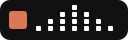
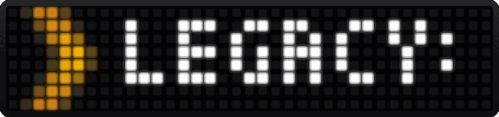
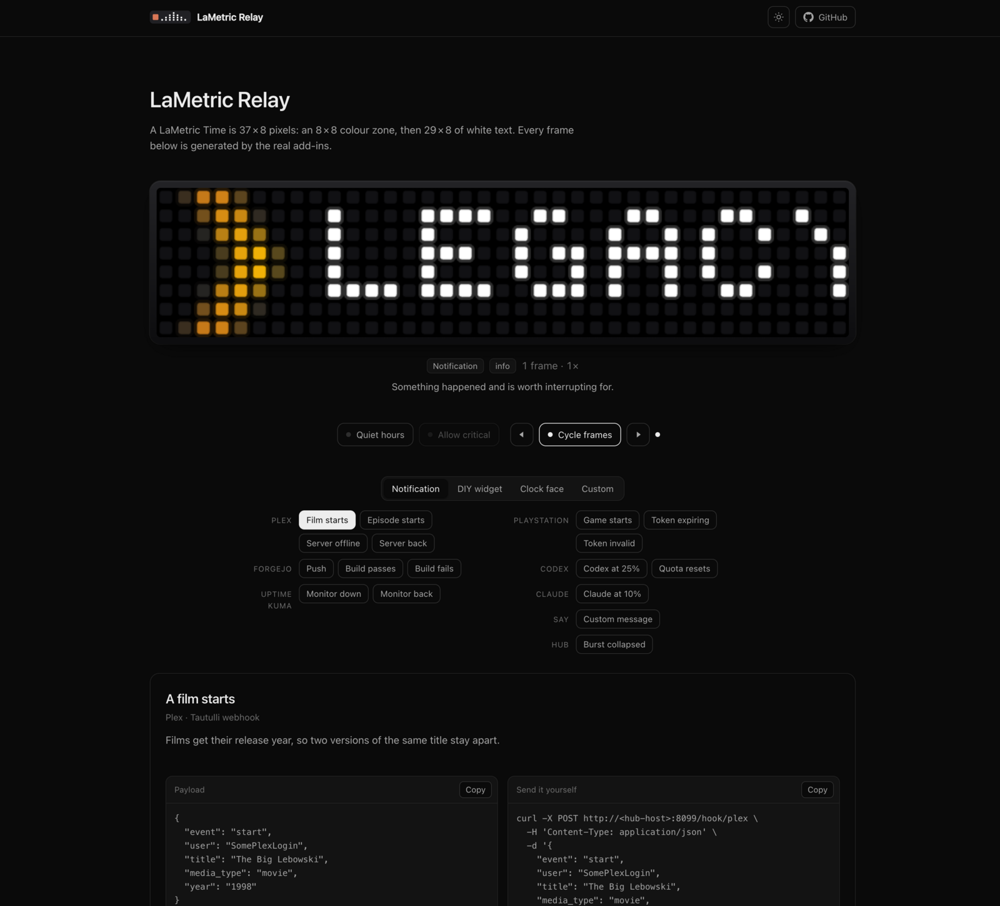

<div align="center">

#  LaMetric Relay

**Local, event-driven notifications for a LaMetric Time.**


<a href="LICENSE"></a>

[Live preview](https://nichtlegacy.github.io/lametric-relay/) · [Quick start](#quick-start) · [Add-ins](#add-ins) · [Documentation](#documentation)



</div>

## Overview

LaMetric Relay connects local services directly to a LaMetric Time. It shows events as
notifications, live data as DIY widgets and optional ambient context on the clock face.

- Local device API — no cloud account in the notification path
- Webhooks and polling with persisted state, quiet hours and burst limiting
- Auto-discovered Python add-ins with isolated failures and no runtime dependencies

## Live preview

**[nichtlegacy.github.io/lametric-relay](https://nichtlegacy.github.io/lametric-relay/)**
is the display in a browser. Pick a source to see what the clock would do, switch quiet
hours on to see what the hub drops, or compose a frame of your own.

<p align="center">
  <a href="https://nichtlegacy.github.io/lametric-relay/"></a>
</p>

## Quick start

Set the device IP from the LaMetric app and the API key from
[developer.lametric.com](https://developer.lametric.com/) under **My Devices**.

```bash
git clone https://github.com/nichtlegacy/lametric-relay.git
cd lametric-relay
cp .env.example .env
cp assets/user_mapping.example.json assets/user_mapping.json
# Set LAMETRIC_HOST and LAMETRIC_KEY in .env
docker compose up -d --build
curl http://localhost:8099/healthz
```

Send a notification through the generic webhook:

```bash
curl -X POST http://localhost:8099/hook/say \
  -H 'Content-Type: application/json' \
  -d '{"text":"Backup complete","icon":"ok"}'
```

Port `8099` has no authentication. Keep it on a trusted LAN; use a VPN or authenticated
reverse proxy for remote senders.

### Without Docker

Python 3.11+ is enough at runtime. ImageMagick is only needed to fetch the icons.

```bash
cp .env.example .env
# Set LAMETRIC_HOST and LAMETRIC_KEY in .env
scripts/fetch-icons.py
set -a && . ./.env && set +a
./hub.py
```

## Add-ins

Unconfigured add-ins disable themselves without affecting the rest of the service.

| Add-in | Mode | Purpose |
| --- | --- | --- |
| [`claude`](addins/claude.py) | poll + widget | Claude quota thresholds |
| [`codex`](addins/codex.py) | poll + widget | Codex quota thresholds |
| [`forgejo`](addins/forgejo.py) | webhook | pushes and action runs |
| [`plex`](addins/plex.py) | webhook + widget | playback and server state |
| [`psn`](addins/psn.py) | webhook + widget | game starts and token errors |
| [`kuma`](addins/kuma.py) | webhook | monitor state changes |
| [`say`](addins/say.py) | webhook | messages from scripts or Home Assistant |
| [`clockface`](addins/clockface.py) | opt-in poll | active source on the clock face |

```bash
./hub.py --list   # loaded add-ins
./hub.py --once   # poll once
```

Sources either push to `POST /hook/<add-in>` or are polled by the hub. The hub owns
state and notification policy; add-ins only translate their source into frames.

To add a source, start with [Writing an add-in](docs/writing-add-ins.md) and the
[`doorbell` example](examples/addins/doorbell.py).

## Documentation

- [Configuration and operations](docs/configuration.md) — settings, Docker, systemd, health and troubleshooting
- [Writing an add-in](docs/writing-add-ins.md) — contracts, events, state, polling and webhooks
- [Making icons](docs/making-icons.md) — fetch, convert and draw 8×8 icons
- [Device notes](docs/device-notes.md) — verified behaviour and device limitations

Health and Prometheus metrics are available at `/healthz` and `/metrics`.

## Project structure

```text
lametric-relay/
├── hub.py, lametric.py   # the two entry points; quota.py names.py version.py support them
├── addins/               # one file per source, loaded at startup; _shared.py is not
├── assets/               # icon manifest and the user-mapping example
├── site/                 # the display preview published to GitHub Pages
├── docs/                 # add-in contract, icons, configuration, device notes, README media
├── examples/addins/      # copyable templates, deliberately outside addins/
├── scripts/              # icon tools, preview build, site capture, agent hook
├── tests/                # assert-based checks, no test framework
├── artwork/              # logo concepts
└── deploy/               # systemd user unit
```

Two things are intentionally absent: the community icons, fetched by
[`scripts/fetch-icons.py`](scripts/fetch-icons.py) from
[`assets/icons.json`](assets/icons.json), and `assets/user_mapping.json`, which holds
real names.

## Development

```bash
for test in tests/test_*.py; do LAMETRIC_KEY=test python3 "$test"; done
```

The checks use plain assertions and need no test framework. See
[CONTRIBUTING.md](CONTRIBUTING.md) for what a new add-in needs.
[`scripts/capture-site.mjs`](scripts/capture-site.mjs) re-records the images above from
the running preview; it is the only thing here that wants Node and Playwright.

## Disclaimer

Unofficial hobby project, not affiliated with or endorsed by LaMetric or any service used
by its add-ins. Device behaviour was verified on an LM 37X8 running firmware 2.3.9.

Community icons are fetched at build time and remain the work of their authors. Use your
own icons when redistributing the project.

## License

Released under the [MIT License](LICENSE).
